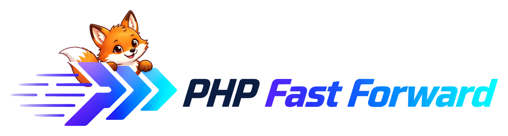

<p align="center">
  
</p>

# PHP Fast Forward identity and organization profile

This repository is the public home of PHP Fast Forward's visual identity,
mascot references, design assets, organization profile, and community defaults.
Framework code and tooling belong in their own
[organization repositories](https://github.com/php-fast-forward).

## Start here

| Source | Responsibility |
| --- | --- |
| [design.md](design.md) | Visual canon, UI tokens, logo applications, mascot anatomy, and pose/use matrix. |
| [style.md](style.md) | Public voice, language, terminology, and evidence in product claims. |
| [soul.md](soul.md) | Character, values, and the Fast Forward fox's relationship with people. |
| [Asset library](assets/README.md) | Reusable exports, metadata, provenance, and consumption rules. |
| [Asset manifest](assets/manifest.json) | Stable asset IDs, hashes, dimensions, and classifications. |
| [Visual specimen](docs/brand/index.html) | Browsable mascot matrix, light/dark previews, and reference families. |
| [References](references/README.md) | Website concepts, historical package art, icons, and divergent explorations. |
| [Design assessment](docs/brand/assessment.md) | Audit findings, decisions, and next artwork/website work. |
| [Mascot production guide](docs/brand/mascot-production.md) | Reference stack, planned pose matrix, and reusable illustration briefs. |

<p align="center">
  
</p>

The neutral fox is the shared character reference. Purple hoodies and package
emblems are established package costumes. References have explicit statuses so
an old concept or divergent illustration cannot silently redefine the mascot.

Open `docs/brand/index.html` in a browser, or serve the repository with
`python3 -m http.server 8765 --bind 127.0.0.1` and visit
`http://127.0.0.1:8765/docs/brand/`. The specimen loads only repository files.

## Organization surfaces

- [profile/README.md](profile/README.md) is the public organization manifesto.
- [profile/assets](profile/assets) retains existing public image paths.
- [.github/FUNDING.yml](.github/FUNDING.yml) holds sponsorship links.
- [CONTRIBUTING.md](CONTRIBUTING.md), [SUPPORT.md](SUPPORT.md),
  [CODE_OF_CONDUCT.md](CODE_OF_CONDUCT.md), [SECURITY.md](SECURITY.md), and
  [ACCESSIBILITY.md](ACCESSIBILITY.md) provide community defaults.
- [.github/ISSUE_TEMPLATE](.github/ISSUE_TEMPLATE) and
  [.github/PULL_REQUEST_TEMPLATE.md](.github/PULL_REQUEST_TEMPLATE.md) support
  issue and review preparation.

GitHub can inherit these defaults in organization repositories that do not
provide their own corresponding files. Repository-specific files take precedence;
templates and files are not copied into consumer clones. See
[GitHub's default community file rules](https://docs.github.com/en/communities/setting-up-your-project-for-healthy-contributions/creating-a-default-community-health-file).

This repository is public. Keep private materials in an appropriate private
repository or local archive. The ignored `backup/` is not a publication surface
or a dependency of the reusable kit. Artwork rights and authoring gaps remain
explicit in the catalog; no inferred license is assigned to supplied artwork.

## Validation

```sh
python3 scripts/validate-brand.py
python3 -m unittest discover -s tests -p 'test_*.py'
npx -y @google/design.md@0.4.0 lint design.md
```

The [asset guide](assets/README.md#token-exports) describes reproducible token
exports. The brand workflow verifies delivered files and validator failure
modes. Visual likeness and complete accessibility still require review.
