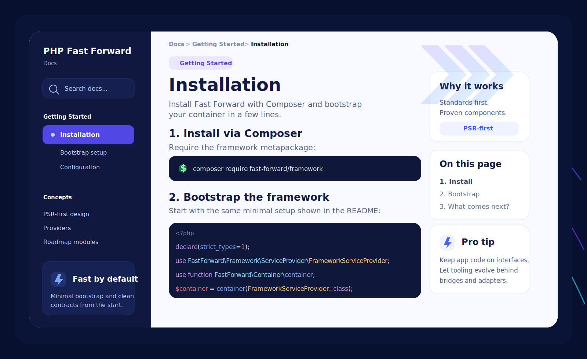
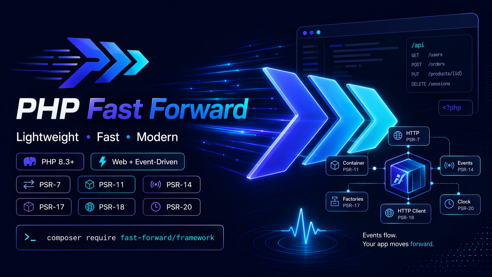

<p align="center">
  
</p>

<p align="center">
  <strong>The PHP framework for developers who want speed without surrendering architecture.</strong>
</p>

<p align="center">
  PSR-first • composable • event-ready • agent-ready
</p>

<p align="center">
  <a href="https://github.com/php-fast-forward/framework"></a>
  <a href="https://github.com/php-fast-forward/dev-tools"></a>
  <a href="https://github.com/php-fast-forward/http"></a>
</p>

<p align="center">
  <a href="https://github.com/php-fast-forward/event-dispatcher"></a>
  <a href="https://github.com/php-fast-forward/container"></a>
  <a href="https://github.com/php-fast-forward/fork"></a>
</p>

## Why Fast Forward exists

Fast Forward is being built for developers who love shipping quickly, but refuse to pay for that speed with framework lock-in, hidden coupling, and architecture that gets harder to evolve every month.

We believe great developer experience should come from excellent defaults, community standards, and battle-tested components. Not from proprietary magic. Not from teaching people to normalize anti-patterns. Not from forcing your application to think like the framework forever.

That is why Fast Forward is PSR-first, interface-first, and composition-first. We stand on the shoulders of the PHP community, trusting standards and proven components such as Symfony, Nyholm, PHP-DI, and Laminas, then wiring them together so your application feels smooth from day one.

Fast Forward already spans more than 30 public repositories. Some are active packages shipping today. Others are intentionally public placeholders for modules that belong to the roadmap and will be implemented over time. The mission is bigger than a package collection: we are building a complete framework ecosystem where you write fewer classes, configure less by hand, and still keep clean architectural boundaries.

<p align="center">
  
</p>

## What makes it different

- **PSR-first by design.** HTTP, containers, events, clocks, factories, and client abstractions follow community standards instead of inventing new walls around your code.
- **Few classes, little ceremony.** Install the metapackage, register the framework provider, and get a practical default stack without hand-wiring every moving part.
- **Composable foundations.** The ecosystem already ships container, config, HTTP, PSR-7/17/18 utilities, PSR-14 events, PSR-20 clocks, iterators, process forking, and more.
- **Battle-tested internals.** Fast Forward leans on respected components from the wider PHP ecosystem and focuses its own code on orchestration, ergonomics, and developer flow.
- **Built for web and event-driven apps.** The framework is not limited to request/response work; it is designed to feel natural for event-driven and async-friendly application design too.
- **Bridge-friendly integration philosophy.** When a great tool already exists, Fast Forward would rather integrate it behind clean contracts and adapters than force your application to depend directly on vendor-specific APIs.
- **Agent-ready from the start.** We are shaping Fast Forward for the next workflow: humans and AI agents building together with reusable skills, subagents, structured automation, and repo-aware tooling.

## The ecosystem already shipping

- [`fast-forward/framework`](https://github.com/php-fast-forward/framework) bundles the core stack behind a single framework service provider.
- [`fast-forward/dev-tools`](https://github.com/php-fast-forward/dev-tools) turns multi-repository maintenance, quality gates, documentation generation, release work, packaged skills, and project-agent workflows into a repeatable workflow.
- [`fast-forward/http`](https://github.com/php-fast-forward/http) gives you a ready-to-use HTTP stack built around PSR-7, PSR-17, and PSR-18.
- [`fast-forward/event-dispatcher`](https://github.com/php-fast-forward/event-dispatcher) brings PSR-14 dispatching, named events, subscribers, priorities, and attribute-based listeners.
- [`fast-forward/container`](https://github.com/php-fast-forward/container) aggregates PSR-11 containers and service providers with a clean integration story.
- [`fast-forward/config`](https://github.com/php-fast-forward/config) provides flexible, layered configuration loading with caching and provider support.
- [`fast-forward/clock`](https://github.com/php-fast-forward/clock), [`fast-forward/fork`](https://github.com/php-fast-forward/fork), and [`fast-forward/iterators`](https://github.com/php-fast-forward/iterators) extend the ecosystem with focused, production-friendly building blocks.

<p align="center">
  
</p>

## Public roadmap

Several public repositories in the organization are there because the shape of the ecosystem matters, even before every module is implemented.

The roadmap already includes:

- console utilities and a cleaner CLI layer for application work
- scheduling primitives and orchestration for recurring jobs
- queue and event-bus capabilities for decoupled async workflows
- more application-facing modules that complete the end-to-end framework experience

The architectural intent is consistent across all of them: whenever possible, Fast Forward will consume proven libraries through bridges, adapters, or integration layers that expose stable Fast Forward contracts. The goal is to keep applications portable and low-coupled, even when the underlying engine changes.

## The force multiplier: Dev Tools

One of the strongest parts of the ecosystem is [`fast-forward/dev-tools`](https://github.com/php-fast-forward/dev-tools). It exists to remove the boring, repetitive, easy-to-forget work that slows down maintainers and open-source teams.

With Dev Tools, Fast Forward repositories can share and propagate repository templates, defaults, and operational conventions without maintainers manually copying files across every project whenever something changes.

For now, Fast Forward skills and project-agent prompts live there as part of the same operational toolkit, instead of being presented as a separate product line.

It also ships serious leverage for consumer repositories:

- documentation generation with pull request previews
- automated wiki generation with preview branches and publication workflows
- test coverage, metrics, code-style fixing, and Rector-based refactoring
- dependency health validation and assisted upgrade workflows
- changelog authoring, validation, next-version inference, release-note rendering, and release automation
- CODEOWNERS, funding metadata, git hooks, repository bootstrap, and synchronized workflow stubs
- packaged project agents, subagents, reusable skills, and automation that works well in both human and AI-agent flows

If you maintain many repositories, this is the kind of tooling that gives you your weekends back.

## The promise in one small snippet

```php
<?php

declare(strict_types=1);

use FastForward\Framework\ServiceProvider\FrameworkServiceProvider;

use function FastForward\Container\container;

$container = container(FrameworkServiceProvider::class);
```

That is the direction: fewer classes, less manual plumbing, better defaults, cleaner boundaries.

## Build with us

If you have ever wanted the momentum of modern PHP frameworks without the coupling tax they usually ask you to accept, you are exactly who Fast Forward is being built for.

Explore the organization, star the repositories that resonate with you, open issues, send pull requests, and help shape a PHP ecosystem that moves fast without teaching people to slow their architecture down.

<p align="center">
  
</p>
